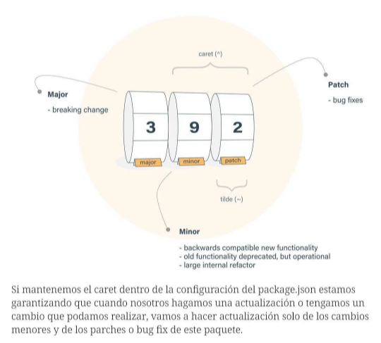

## Configurar CRLF a LF en VSCode en Windows

Ve a **File > Preferences > Settings**, busca **settings.json** en el campo de busqueda y da click en editar **settings.json**.

Agrega la siguiente linea de código en tu configuración para dejar **LF** como predefinido.

```json
"files.eol": "\n"
```

#  Comandos de NPM 

JavaScript es un lenguaje que fue diseñado para dar interactividad a la web, del lado del cliente **(Frontend)**  y este mismo se ha podido usar del lado del servidor gracias **Node.js** el cual es un entorno de ejecución del lado del servidor.

Para poder trabajar con Node, es necesario ir implementando modulos según nuestro proyecto lo requiera, es ahí donde entra **npm**.

**NOTA:** Para poder usar npm es necesario tener instalado Node JS https://nodejs.org/es/
Para verificar esto, puedes escribir `$ node -v` para ver si este está instalado y cual es versión. 
## ¿Qué es NPM?

**Node Package Manager** es un gestor de manejo de paquetes escritos en JavaScript lo cual **npm** nos permite obtener cualquier librería de JS con una sola linea de código en nuestro entorno de trabajo. 

Aquí los comando que necesitas saber para manejar **npm** como un experto.

### Comandos Básicos

`$ npm init` // Nos permite inciar un npm en nuestro proyecto y crea un package.json con los datos del proyecto.

`$ npm init -y` // Crea un package.json con los datos vacios o los configurados por el usuario dentro del proyecto.

`$ npm set init.author.email "me@email.com"` // Deja configurado un mail para los proyectos.

`$ npm set init.author.name "Tu nombre"` // Guarda el nombre del autor para futuros proyectos.

`$ npm set init.license "MIT"` //Guarda la configuración de licencias predeterminada para todos los proyectos.

### Instalación de dependencias.

Las dependencias deben ser instaladas en la carpeta raíz del proyecto.

`$ npm i package `,
`$ npm install package` // Instalan la dependencia.

`$ npm install package -D` // Instala solo lo necesario para un entorno de desarrollo. Es decir, no irá a producción.

`$ npm install package -g` // Instala una dependencia de forma globa. Esto permite que podamos utilizar este paquete en diferentes proyectos. Por lo general debe instalarse con permisos de administrador.

`$ npm list -g --depth 0` // Muestra los paquetes que están instalados de forma global.

`$ npm list` // Muestra los paquétes que tiene el proyecto.

`$ npm install package -O` // Podemos instalar de forma opcional un paquete con este comando.

`$ npm install package --dry-run` // No instala el paquete, solo es para simulación y muestra el output como si estuviese instalado.

`$ npm install package -f` // Instala un paquete forzando la instalación.

`$ npm install package@<version>` // Instala la dependencia en una versión en especifico.

`$ npm install npm@latest`  // Actualiza la dependencia a la ultima versión disponible.


### Actualizar y eliminar.

`$ npm outdate`  // Nos muestra si se encuentran los paquetes y además nos indica la ultima versión disponible de los paquetes.

`$ npm udpate`  // Actualiza los paquetes que se tengan desactualizados.

`$ npm install package@latest` // Podemos actualizar un paquete en especifico a su versión más reciente.

`$ npm uninstall package` // Podemos eliminar un paquete en especifico.

`$ npm unistall package --no-save` // Nos permite desinstalar o eliminar el paquete pero sin eliminarlo del package.json pero si de node_moduls.


### Símbolos de ^ y ~


### Ejecutar Tarea (script)

`$ npm run <script-name>` // Ejecuta el script que cremos dentro del package.json, scripts.

### Solución de Problemas

Uno de los problemas que podemos toparnos en la construcción de proyectos, es que nuestros archivos de **node_moduls** no están correctamente instaladas o tengamos una versión anterior. 

Una forma de solucionarlo es eliminar la carpeta **node_moduls** o ejecutar un comando que nos va a dar seguridad de limpiar ese cache que pueda existir.

`$ npm cache clean -f || $ npm cache clean --force` // Elimina la cache.

`$ npm cache verify` // Con esto podemos ver si ya se ha eliminado el cache y que todas las instalaciones de nuestros recursos van a ir a servidores NPM.

### Seguridad

Podemos verificar si tenemos algún problema de seguridad usando algunos de estos comandos.

`$ npm audit` // Muestra las vulnerabilidades y si estos son de alto nivel.

`$ npm adudit --json ` // Genera el reporte en formato JSON.

`$ npm audit fix` // Actualiza todas las dependencias a su ultima versión para evitar vulnerabilidades.

### Probar nuestro paquete npm localmente.

`$ npm link` // Esto nos creara un enlace simbólico en la carpeta global (.npm-global) que se vincula al paquete o proyecto donde se ejecutó el comando. El nombre de este enlace simbólico donde se ejecutó el comando. El nombre de este enlace simbólico se toma el campo "name" del package.json. Lo recomendado es que el valor de "name" inicie con un @.
**Ejemplo: "name:" "@boogst/project-name**"

`$ npm link "@boogst/project-name"`  // Si queremos usar el paquete anterior en algún proyecto debemos referenciarlo con este comando. Recuerda que debes estar ubicado en el proyecto "nuevo" que quieres imlementar ese paquete.

`$ npm unlink "@boogst/project-name"` // Este comando nos permite deslinkear el paquete.


### Publicar en NPM.

`$ npm adduser` // Permite agregar un usuario de npm.

`$ npm login` // Nos permite iniciar sesión.

`$ npm publish` // Para publicar un proyecto en npm. Recuerda que debes estar ubicado en la carpeta raíz del proyecto.

`$ npm unpublish -f` // Para des publicar un paquete. Recuerda que debes estar en la carpeta raíz del proyecto.


`$ npm version <major | minor | patch>` // Nos permite actualizar la versión de nuestro paquete.
